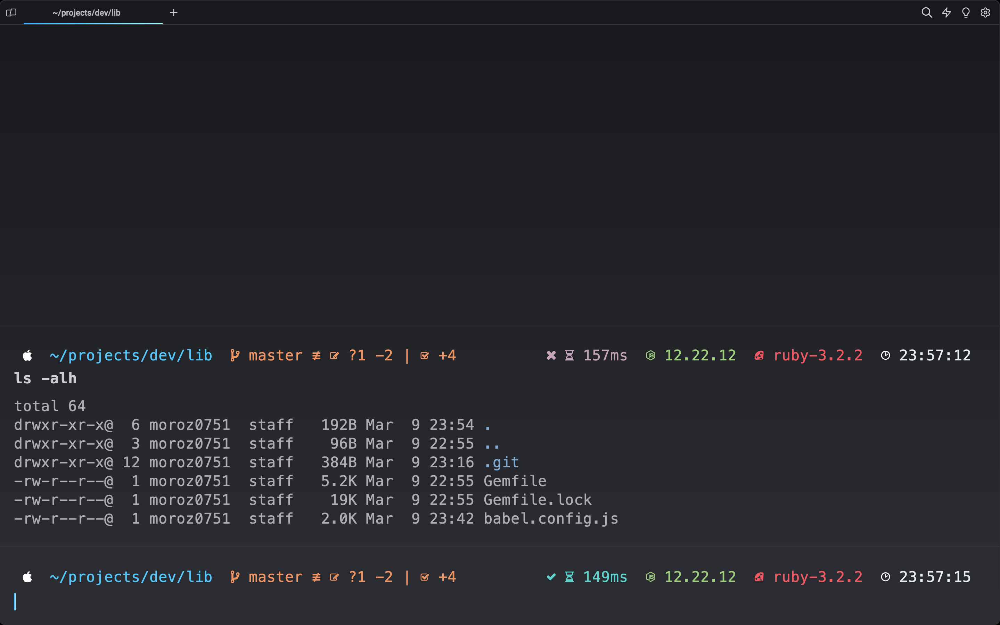
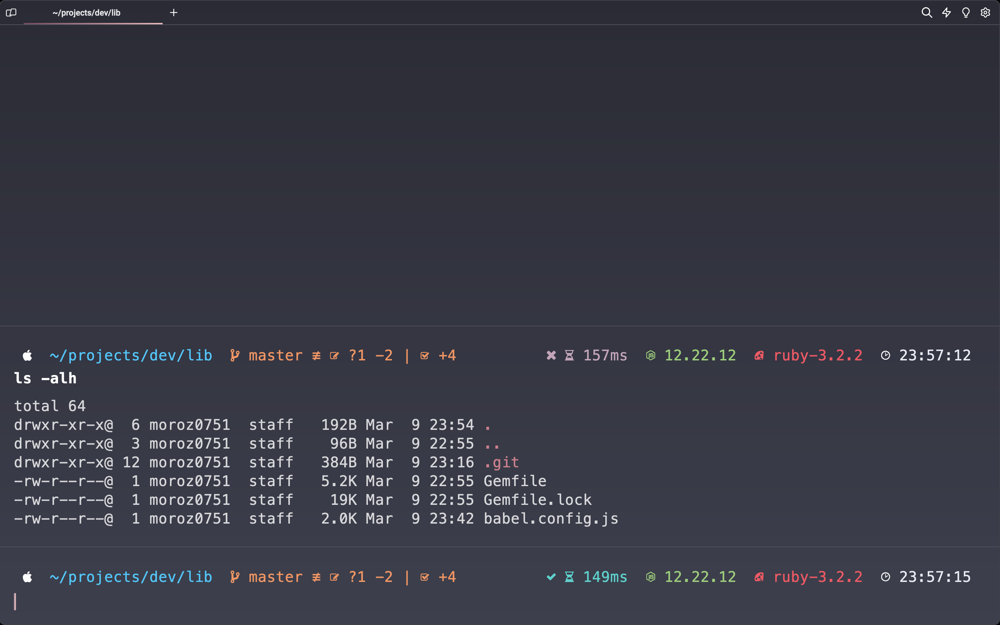

# One Brilliant Gravity Theme for Warp

Dark themes for [Warp](https://www.warp.dev/) terminal with cyan and lux color variations.

## Preview

### Cyan

### Lux

The custom prompts shown here are the [Brilliant theme](https://github.com/moroz0751/oh-my-posh-brilliant) for Oh-My-Posh.

## Install

1. Download the `.yml` theme file(s) to your Warp's custom theme directory (see [official documentation](https://docs.warp.dev/appearance/custom-themes) for details)
2. Navigate to Appearance settings in Warp and pick your theme!
